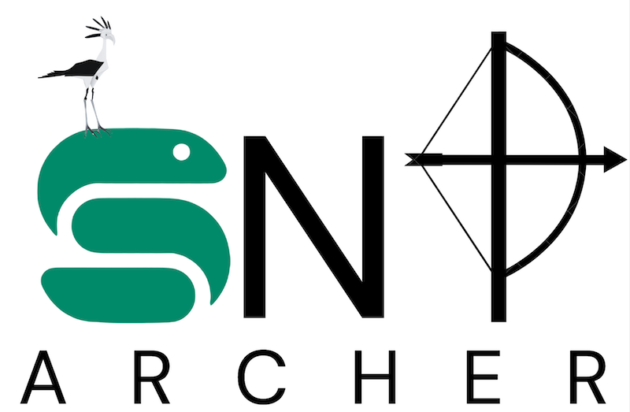
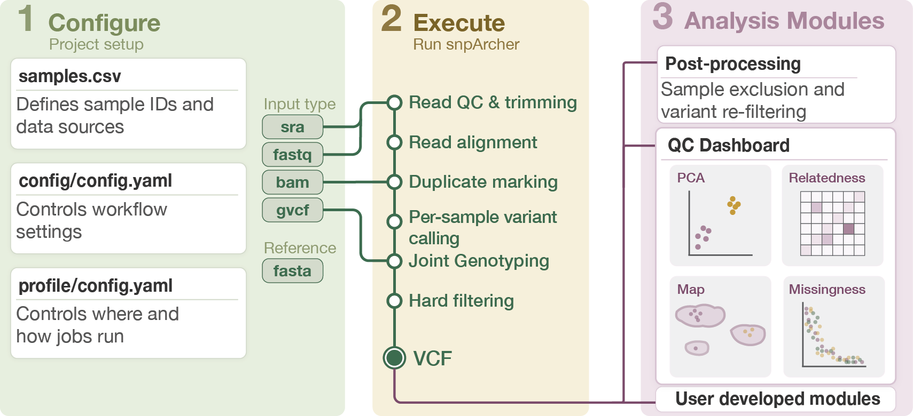

<h1 style="display:none;">snpArcher</h1>

  

**A Snakemake workflow for whole-genome resequencing and variant calling, designed for non-model organisms.**

snpArcher takes you from raw FASTQ reads (or SRA accessions) to a filtered, analysis-ready VCF.
It handles trimming, alignment, variant calling, joint genotyping, quality control, and postprocessing in a single reproducible pipeline.
Built for researchers working with non-model organisms (birds, fish, insects, plants, and everything else without a curated reference panel).

## What does snpArcher do?

Plus optional modules for **QC dashboards** and **postprocessing/filtering**.

## Where to start

| I want to… | Go to… |
|---|---|
| Install snpArcher | [Installation guide](how-to/install.md) |
| Verify my install works | [Quickstart](tutorials/quickstart.md) |
| Process my own data end-to-end | [Your first project](tutorials/first-project.md) |
| Look up a config option | [Config schema](reference/config-schema.md) |
| Understand the pipeline design | [Architecture](explanation/architecture.md) |

## Citing snpArcher

If you use snpArcher in your research, please cite:

> Mirchandani, C.D. et al. (2024). A fast, reproducible, high-throughput variant calling workflow for population genomics. *Molecular Biology and Evolution*, 41(1), msad270. [doi:10.1093/molbev/msad270](https://doi.org/10.1093/molbev/msad270)
